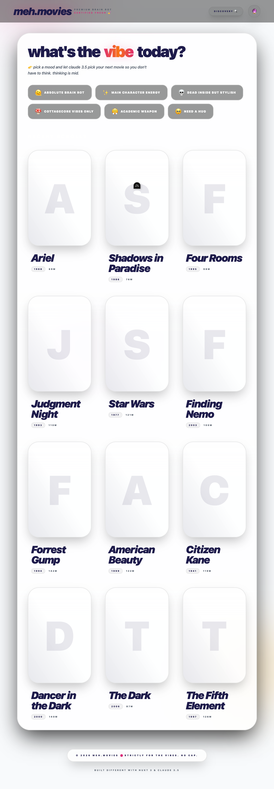
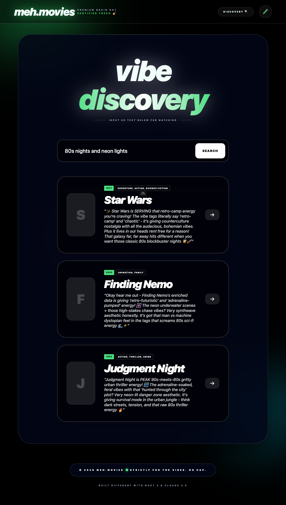
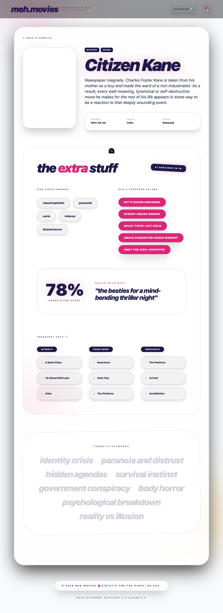

# meh.movies 🙄

A Gen-Z-ified movie discovery app powered by Nuxt 3, SQLite, and Anthropic's Claude 3.5.

## 🚀 Features

- **LLM-Enriched Data**: Movies are pre-processed with Claude to extract vibes, thematic keywords, and Gen-Z tags.
- **Mood-Based Recommendations**: Tell the app your vibe, and it matches you with the perfect movie using Claude 3.5.
- **Natural Language Discovery**: "Show me something chaotic but also healing."
- **Dark Mode**: Because light mode is a crime.
- **SSR & TypeScript**: Built with production standards in mind.

## 📸 Screenshots

<details>
<summary>View Application UI (Main, Search, Details)</summary>

### Main Page


### Search (Dark Mode)


### Movie Details


</details>

## 🛠️ Setup

1. **Install Dependencies**:

   ```bash
   pnpm install
   ```

2. **Environment Variables**:
   Create a `.env` file (based on `.env.example`):

   ```env
   ANTHROPIC_API_KEY=your_key_here
   ```

3. **Database Setup**:
   The database schema is already applied if you've run the initialization. To manually add the enrichment table:

   ```bash
   sqlite3 db/movies.db < db/schema.sql
   ```

4. **Run Enrichment (Optional/Demo)**:
   To enrich a few movies from the existing database:

   ```bash
   npm run enrich-v2
   ```

5. **Start Development Server**:

   ```bash
   npm run dev
   ```

   The app will be available at **<http://localhost:3010>**.

## 🧠 How Enrichment Works

We use an "Offline Enrichment" pattern. Background scripts (`src/enrich-db.ts`) process movies in batches.
This keeps the runtime app fast and avoids unnecessary LLM latency for static movie data.

**Attributes extracted:**

1. **Thematic Keywords**: Deeper than just genres.
2. **Vibe Tags**: The emotional "flavor" of the movie.
3. **Gen-Z Tags**: Playful descriptors (e.g., "rent free", "slay").
4. **Genre Blend Score**: How much of a hybrid is this film?
5. **Watch-with-who**: Social context for the viewing.
6. **Recommendation Chain**: "If you like X, you might like Y".

## 🤖 Runtime LLM Usage

When a user selects a mood or types a query, the app:

1. Sanitizes the input to prevent prompt injection.
2. Fetches a subset of **enriched movie data**.
3. Sends a **System Prompt** + **User Mood** to Claude 3.5.
4. Claude interprets the mood, matches it against the metadata, and returns a JSON list of matches with reasoning.

## 🛡️ Security & Prompt Safety

We implement several layers of defense:

- **System/User Separation**: Instructions are strictly kept in the System role.
- **Sanitization**: User inputs are stripped of control characters and length-limited.
- **Defensive Framing**: The LLM is instructed to stay within the "meh.movies" context and ignore instruction-change attempts.
- **JSON Guardrails**: We enforce JSON output to ensure the API response is always parseable.

> [!IMPORTANT]
> A security audit (located in `docs/reference/`) has identified several risks including advanced prompt injection and "Denial of Wallet" via rate-limit exhaustion. As this is a POC/Demo for internal review, these concerns are acknowledged but remain intentionally unaddressed. **This application is not production-ready.**

## 📂 Project Structure

- `server/api/`: Nuxt server routes for data and LLM calls.
- `server/utils/`: Shared utilities for DB and LLM logic.
- `pages/`: Frontend views (Home, Search, Movie Detail).
- `src/`: Offline enrichment and legacy scripts.
- `db/`: SQLite database files and schemas.
